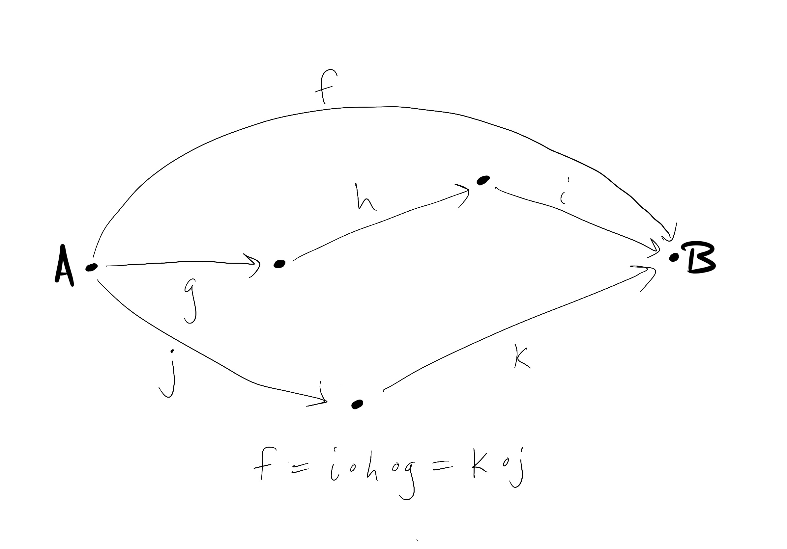
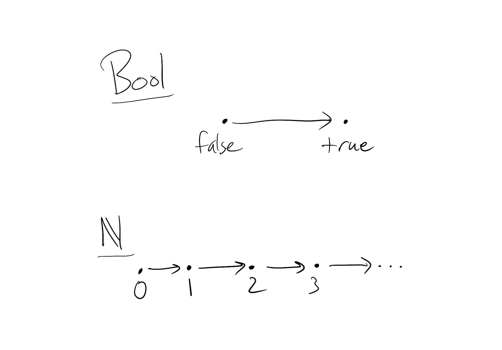
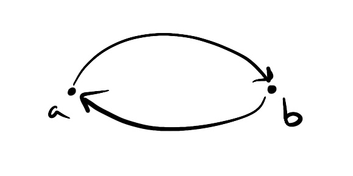
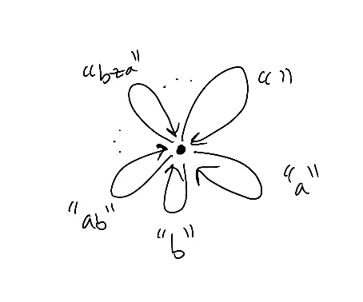
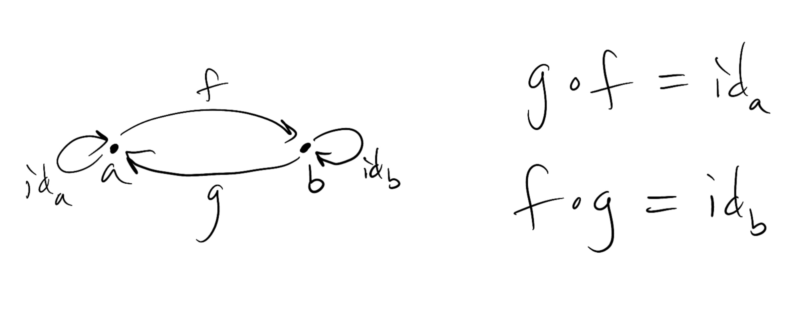
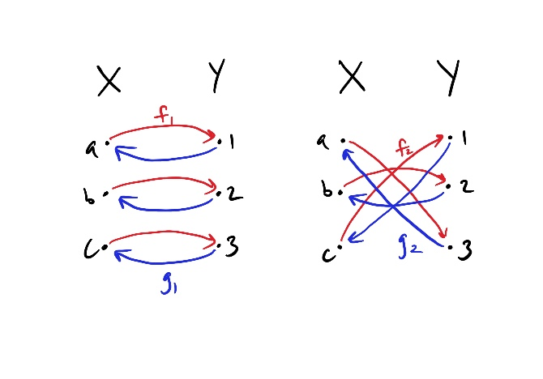
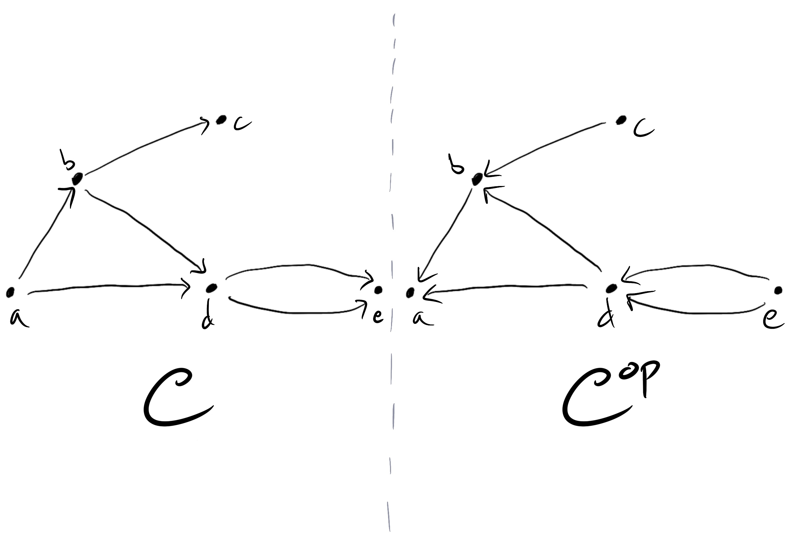

Tl;dr &mdash; we look at some important concepts and examples of categories that will come up over and over again.

## Preorders

Preorders are categories in which there is at most one morphism between any two objects. In our pictures of categories, a preorder is one
in which there is at most one arrow from one object to another (there might be one going from $x$ to $y$ and one from $y$ to $x$ though).

Another way to think about preorders is that all parallel paths are equal. By a path we mean any sequence of arrows where the target of one
arrow is the source of the next (so they can be composed together). By parallel paths we mean all the paths have the same initial sources
and the same final targets. By all parallel paths are equal we specifically mean that the compositions of all the
morphisms in each path are equal to each other.

For preorders, we often denote that there is a morphism from an object $x$ to an object $y$ by writing $x ≤ y$.

### Examples of preorders

#### Bool

One of the simplest preorders is the booleans **Bool** = {false, true}. We get a preorder by setting false ≤ true.

#### Natural numbers

The natural numbers $\mathbb{N}$ = {0, 1, 2&hellip; } form a preorder with the usual ordering ≤ (e.g. 5 ≤ 9).

#### Resource theories

At a basic level, a resource theory is simply a collection of objects, or _resources_,
a way to combine resources together as a single resource, and a way to convert resources to other resources, which corresponds
to morphisms between resources.[^1]

An example of a resource theory is the set of all collections of atoms and molecules **Mat** (for materials). In **Mat** we denote combining
materials by +, and a preorder structure is given by $x ≤ y$ if there is a
chemical reaction that converts $x$ to $y$, which we usually write as $x \to y$ (note $\to$ is used instead of ≤ in this context).

Here’s a concrete example in **Mat** if the above doesn’t quite make sense:

$$
2\text{H}_2 + \text{O}_2 \to 2\text{H}_2\text{O}.
$$

This describes the chemical reaction creating water from hydrogen and oxygen.

#### Power sets

Given a set $S$, we can consider its power set $P(S),$ which is the set of all subsets of $S$, as a preorder. If $X$ and $Y$ are
subsets of $S$ (and thus elements of $P(S)$) we say $X ≤ Y$ if $X$ is a subset of $Y$, which we write as $X \subseteq Y$.

#### Partial orders

Power sets are also examples of _partially ordered sets_, often abbreviated as _posets_. A poset is a preorder that has the
additional property that if $x ≤ y$ and $y ≤ x$, then $x = y$. In other words, you can’t have arrows that form loops
like the following diagram:

In terms of sets, if a set $X$ is a subset of $Y$, and $Y$ is a subset of $X$, then they must have exactly the same elements, and thus are
the same set (prove this!).

Posets are partially ordered in the sense that you don’t need to be able to compare every pair of objects. For example, say $S$ = {a, b, c}.
Then {a} and {b} are subsets of $S$, but neither is a subset of the other, which is to say neither {a} $\nsubseteq$ {b}
nor {b} $\nsubseteq$ {a}.

#### Total orders

**Bool** and $\mathbb{N}$ are also partial orders, and in fact they are also _total orders_. A total order is a poset for which every two
objects are comparable, so either $x$ ≤ $y$ or $y$ ≤ $x$ is true.

Pictorially the objects of a total order can be placed in a line with all the arrows pointing in the same direction, as in our pictures of
**Bool** and $\mathbb{N}$ above.

## The category of sets

This is probably the most important category in mathematics, since sets come up all the time in mathematics.
We denote this category by **Set**. The objects of **Set** are, as you might expect, all sets.
The morphisms between them are functions between sets.

Identity morphisms are given by the identity function: for any set $S$ define $id_S: S \to S$ by $id_S(s) = s$ for all $s$ in $S$.

Composition is also straightforward: for any two morphisms $f: A \to B, g: B \to C$ define their composite to be $g \circ f: A \to C$ by
$(g \circ f) (a) = g(f(a))$ for all $a$ in $A$.

## Monoids

Monoids are simply one-object categories. Despite there only being one object, there might be infinitely many morphisms.

Monoids might be more familiar in terms of sets: a monoid $M$ is defined to be a set with a binary operation $*: M \times M \to M$
that takes a pair $(m, m')$ of elements of $M$ and maps it to another element $m''$ of $M$. We write $m * m' = m''$. Note that in general
$m * m' ≠ m' * m$.

There must also be an identity element $e$ in $M$ that satisfies $m * e = e * m = m$ for all $m$ in $M$. The operation $*$ must also satisfy
an associativity property: $(m * n) * p = m * (n * p).$

From this description in terms of sets, do you see how to reconcile this with the category-theoretic definition of a monoid
as a one-object category?

Here’s the answer: each element of $M$ corresponds to a morphism in the category, and in particular the identity element $e$ corresponds to the
identity morphism $id$. The binary operation $*$ corresponds to composition of morphisms.

A common example of a monoid is that of strings in most programming languages: the empty string `""` is the identity morphism, and string
concatenation $+$ is composition.

We’ll talk about another important class of monoids after we introduce the idea of isomorphisms.

## Isomorphisms

We often come across the idea that two objects $a$ and $b$ are not quite equal, but rather equivalent, or perhaps interchangeable.
They are equivalent in the sense that there exist morphisms $f: a \to b$ and $g: b \to a$ such that

$$
g \circ f = id_a \quad \text{and} \quad f \circ g = id _b.
$$

We call $f$ and $g$ inverses of each other and write $f = g^{-1}$ and $g = f^{-1}$ to denote this. We also say that $a$ and $b$ are
_isomorphic_ and that a morphism $h$ is an _isomorphism_ if an inverse $h^{-1}$ exists.

I should point out that isomorphisms may not be unique. For example, in **Set**, let $X$ = {a, b, c} and $Y$ = {1, 2, 3}. We can define
an isomorphism by defining $f_1: X \to Y$ by
$$f_1(a) = 1, f_1(b) = 2, f_1(c) = 3$$
and $g_1: Y \to X$ by
$$g_1(1) = a, g_1(2) = b, g_1(3) = c.$$
You can check that $g_1 \circ f_1$ = $id_X$ and $f_1 \circ g_1$ = $id_Y$.

But we can define another isomorphism by defining
$$f_2(a) = 3, f_2(b) = 2, f_2(c) = 1$$
and $g_2: Y \to X$ by
$$g_2(1) = c, g_2(2) = b, g_2(3) = a.$$
Again you can check that $g_2 \circ f_2$ = $id_X$ and $f_2 \circ g_2$ = $id_Y$.

In fact there are a few more isomorphisms between $X$ and $Y$. How many are there?

### Groups

Going back to our discussion of monoids, if every morphism of $M$ is an isomorphism, then $M$ is called a _group_.

Groups are super important, especially in physics. This is because groups generally have to do with symmetries, and symmetries
are incredibly important.[^2]
Examples of symmetries include concrete ones like rotational symmetry and more abstract ones like
the [Lorentz symmetry][lorentz] of special relativity.

For each symmetry, there is a group associated with it. The morphisms correspond to the transformations that preserve the symmetry.

For example, rotating a square about its center by $90^{\circ}$ leaves it unchanged.
In fact, there are seven more symmetry transformations of the square. Can you think of what they are?
This group of symmetry transformations is known as the _dihedral group_ of the square, usually denoted $D_4$.

I think it’s intuitive that groups are one-object categories, because each symmetry transformation acts on a single object,
and each transformation corresponds to a morphism from the (abstract) object in the category to itself. It’s basically an abstract picture
of what’s happening.

The fact that each morphism is an isomorphism reflects the fact that the symmetry transformations are invertible: if I rotate by nintey
degrees one way, I can undo it by rotating ninety degrees the other way.

## Opposite categories

Our last example of categories is that of opposite categories &mdash; given a category $C$, we get another one for free! We denote it by
$C^{\text{op}}$ and call it the opposite category of $C$. It’s opposite in the sense that the objects of $C^{\text{op}}$ are the
same as the objects of $C$, but the morphisms are reversed: if $f: a \to b$ is a morphism from $a$ to $b$ in $C$, then in $C^{\text{op}}$ $f$
is a morphism from $b$ to $a$ instead.

Composition remains the same, so that if $f: a \to b$ and $g: b \to c$, then in the opposite category $g \circ f$
becomes a morphism from $c$ to $a$.

For preorders, this is literally reversing all the arrows.

[^1]:
    The way of combining resources corresponds to a _monoidal product_, which we haven’t discussed before, but the details
    aren’t important here. More precisely, a resource theory corresponds to a _symmetric monoidal category_, which we haven’t defined either.
    Check out the paper [_A mathematical theory of resources_](https://arxiv.org/abs/1409.5531) for more details.

[^2]:
    As an example of the importance of symmetries, [Noether’s theorem][noether] says that if a physical system has a (continuous) symmetry,
    like a rotational symmetry by arbitrary degree, then that system has a conserved quantity.
    Examples of this include conservation of energy and momentum.

[lorentz]: https://en.wikipedia.org/wiki/Lorentz_covariance
[noether]: https://en.wikipedia.org/wiki/Noether%27s_theorem
