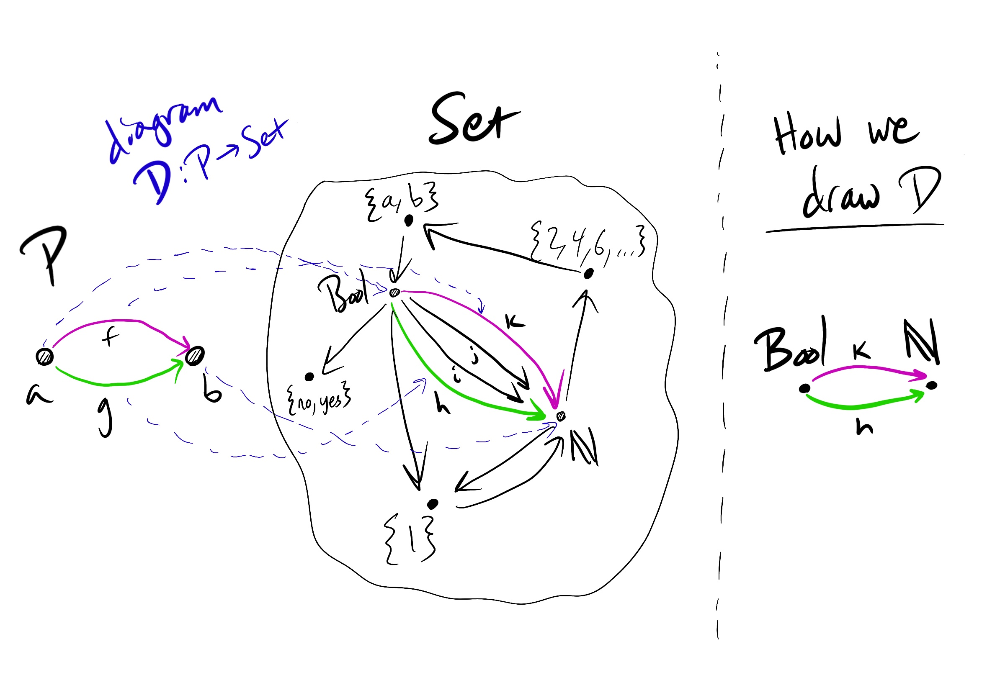
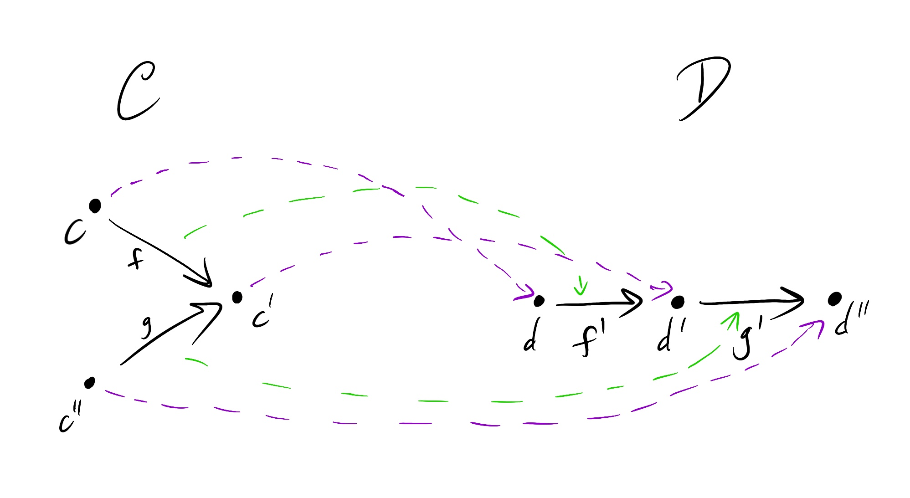
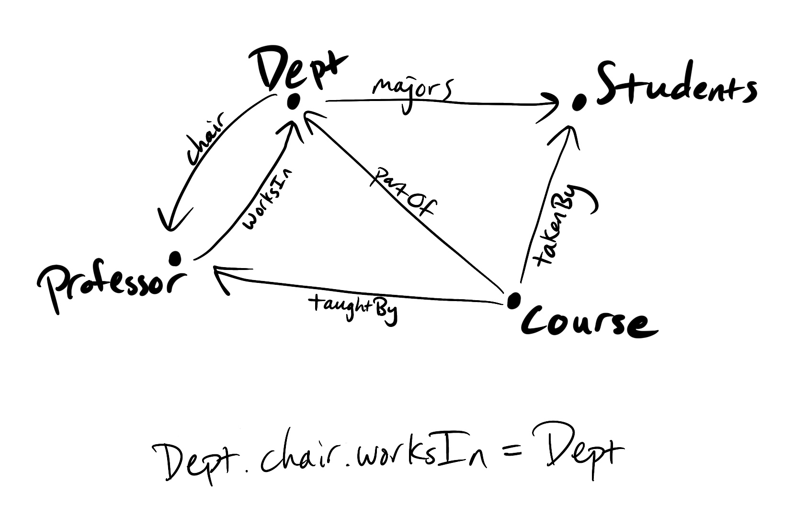
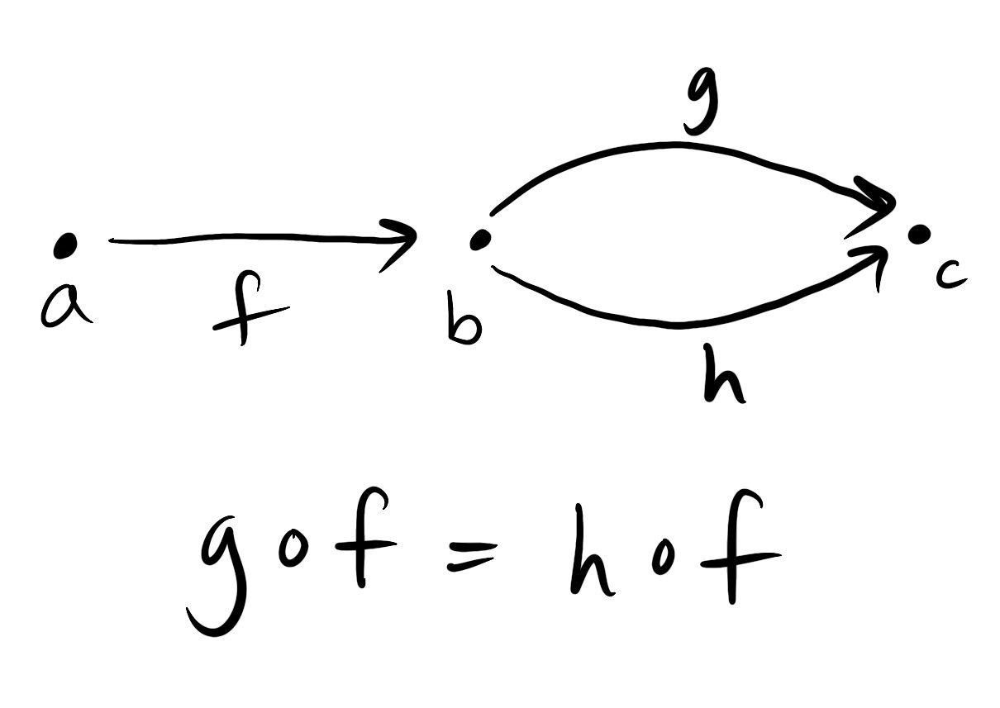
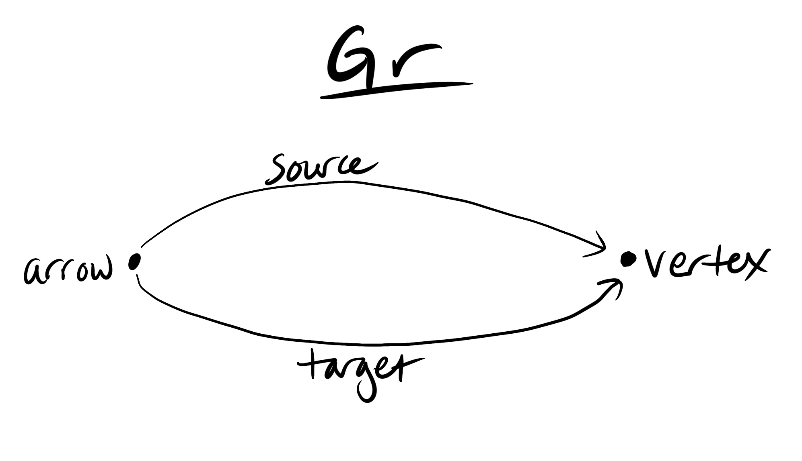
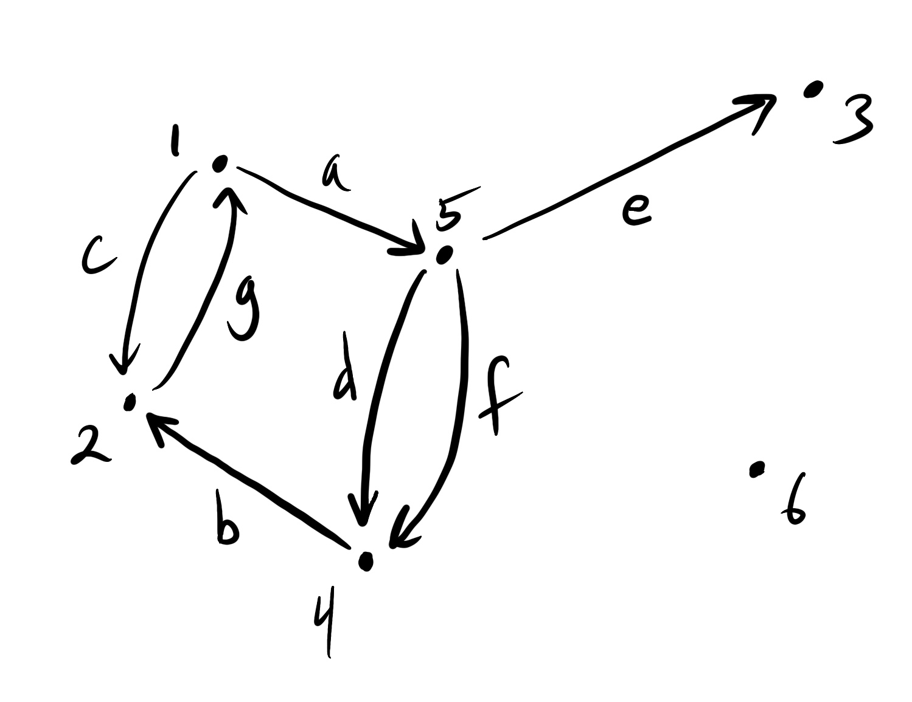

import { Link } from "gatsby"

> Tl;dr &mdash; We introduce functors, which allow us to relate different categories. As an applied example, we think of database schemas
> as categories and database instances as functors.

We often want to relate one category to another. Perhaps we see that one category is embedded inside of another one, or that we can
simplify our view of a category by mapping it onto a less complex one, or that one category is in some sense the same
as another one. _Functors_ formalize these ideas. They’re like the mathematical version of analogies.

A functor $F$ from a category $\mathcal{C}$ to a category $\mathcal{D}$, written as $F: \mathcal{C} \to \mathcal{D}$,
associates an object $F(c)$ in $\mathcal{D}$ for every object $c$ in $\mathcal{C}$ and a morphism $F(f): F(c_1) \to F(c_2)$
in $\mathcal{D}$ for every morphism $f: c_1 \to c_2$ in $\mathcal{C}.$

Furthermore, $F$ must respect the structure that defines a category, namely identities and composition. This means that

$$
F(id_c) = id_{F(c)}
$$

for every $c$ in $\mathcal{C}$ and that for any three objects $c_1, c_2, c_3$
and morphisms $f: c_1 \to c_2, g: c_2 \to c_3$ in $\mathcal{C}$,

$$
F(g \circ f) = F(g) \circ F(f)
$$

in $\mathcal{D}$.

In plain words, these equations say that $F$ maps identity morphisms to identity morphisms and that a composition of two morphisms
is mapped to the composition of the mappings of the two morphisms.

## Examples of functors

### Diagrams

Our pictures of categories, now referred to as _diagrams_, are in fact functors! Formally, a _diagram $D$ of shape $\mathcal{J}$
in $\mathcal{C}$_ is a functor $D: \mathcal{J} \to \mathcal{C}$.

This definition really confused me when I first encountered it, until I realized that what we draw is the _image_ of the functor.
This is a lot like when we plot a function, say, the parabola $y = x^2$, we often say that the graph _is_ the function.
Here’s a picture that illustrates what I mean:

In this picture $P$ is a category with two objects $a$ and $b$ with two morphisms $f$ and $g$ that go from $a$ to $b$.
I’ve also drawn a few sets in the category $\mathbf{Set}$[^1] and a few arrows representing functions between them. We want a diagram $D$ of this shape
relating $\mathbf{Bool}$ to $\mathbb{N}$. $D$ sends $a$ to $\mathbf{Bool}$ and $b$ to $\mathbb{N}.$ $D$
also selects two functions from $\mathbf{Bool}$ to $\mathbb{N}$ to map $f$ and $g$ to: $f$ to $k: \mathbf{Bool} \to \mathbb{N},$
and $g$ to $h: \mathbf{Bool} \to \mathbb{N}$.

To the right of the dotted line, I’ve drawn the image of the diagram $D$, which is what we would normally draw for $D$.

### Isomorphic categories and a category of categories

Each category $\mathcal{C}$ has an identity functor $id_{\mathcal{C}}: \mathcal{C} \to \mathcal{C}$ which, as you might guess,
takes each object to itself and each morphism to itself.

Our notation for identity functors and general functors between categories is really similar to the notation
used for morphisms within a category. This is no coincidence.

We can define a category of categories by taking the objects to be categories and the morphisms to be functors between categories.

Composition of two functors $F: \mathcal{A} \to \mathcal{B}$ and $G: \mathcal{B} \to \mathcal{C}$ is given by the functor
$G \circ F: \mathcal{A} \to \mathcal{C}$ defined by sending objects $a$ of $A$ to $G(F(a))$ and morphisms $f: x \to y$ of $\mathcal{A}$ to
$G(F(f)): G(F(x)) \to G(F(y)).$

Following our discussion of isomorphisms in my <Link to="/posts/more-on-categories">last post</Link>, two categories
$\mathcal{C}$ and $\mathcal{D}$ are isomorphic if there are functors $F: \mathcal{C} \to \mathcal{D}$ and
$G: \mathcal{D} \to \mathcal{C}$ such that

$$
G \circ F = id_\mathcal{C} \quad \text{and} \quad F \circ G = id_\mathcal{D}.
$$

Isomorphic categories have exactly the same structure.

### Embedding one category within another

Going from a smaller category $\mathcal{C}$ to a larger category $\mathcal{D}$ (in terms of objects),
we can think of a functor as embedding $\mathcal{C}$ in $\mathcal{D}$ if no information is lost, i.e., no objects or morphisms in
$\mathcal{C}$ are collapsed together in $\mathcal{D}$.

### Collapsing categories

#### Example from Bool to Set

Recall $\mathbf{Bool}$ is the two-element preorder given by false $≤$ true. We can define a functor $F: \mathbf{Bool} \to \mathbf{Set}$
by $F(\text{false}) = F(\text{true}) = [0, 1]$ where $[0,1]$ is the set of all real numbers in between and including 0 and 1. $F$ sends
$≤: \text{false} \to \text{true}$ to $f: [0, 1] \to [0,1]$ defined by $f(x) = x^2$ for all $x$ in $[0, 1].$

#### Constant functors

An extreme case is a constant functor, which maps all objects to a single object $c$ in the target category and
all morphisms to the identity morphism $id_c$.

## Nonexamples of functors

In the picture below, on the left we have a preorder $\mathcal{C}$ that consists of three objects $c, c', c''$ where both
$c$ and $c''$ are $≤ c'$ (the corresponding arrows are labeled $f$ and $g$). On the right is a preorder $\mathcal{D}$ with three objects
$d, d', d''$ where $d ≤ d' ≤ d''$ (the corresponding arrows are labeled $f'$ and $g'$).

I’ve also drawn a mapping of objects and morphisms of $\mathcal{C}$ to $\mathcal{D}$ which is _not_ a functor. The mapping respects the
direction of $f$, but it reverses the direction of $g$, in the sense that $g$ has source $c''$, which maps to $d''$, and
target $c'$, which maps to $d'$, but $g$ is mapped to $g'$ which has source $d'$ and target $d''$.

As we just saw, if a mapping of categories from $\mathcal{C}$ to $\mathcal{D}$ reverses morphisms, then the mapping can’t be a functor&hellip;
unless it reverses _all_ the morphisms, in which case it could be a functor from the opposite category $\mathcal{C}^{\text{op}}$
to $\mathcal{D}$ (as long as it preserves identities and composition of course). Such a functor is known as a _contravariant functor_.
A regular functor is referred to as a _covariant functor_.

### An application: database schemas and instances

A database schema $\mathcal{C}$ is essentially a finitely-presented category with path equations.

By finitely-presented category,
we mean that the category is obtained by interpreting a finite graph as a category (taking vertices as objects and arrows as morphisms),
and any relationships between morphisms (often thought of as constraints or business rules) are given by path equations.

Here’s an example schema for a university that is pretty self-explanatory:

We have a constraint Dept.chair.worksIn = Dept, which says that the chair of a department works in that department. This
constraint leads to other constraints, like Professor.worksIn.chair.worksIn.chair = Professor.worksIn.chair, which amounts to saying
that a professor’s department chair’s chair is themself.

An _instance_ (in time) of a database schema $\mathcal{C}$, i.e., actual data, is a functor from $\mathcal{C}$ to **Set**. One way to think
about this is that the schema is the abstract structure, and the functor is a _representation_ of that structure in the form of
concrete data.

Here is a schema $\mathcal{C}$:

We can give this a concrete representation as a database instance by defining a functor $F: \mathcal{C} \to \textbf{Set}$ by setting
$F(a)$ to be the set of all college students in the US, $F(b)$ to be the set of all students at a given university $X$, and $F(c)$ to be
the power set of all courses at $X$.

$F(f)$ selects out the all students at the university $X$ who got all A’s, $F(g)$ maps students at $X$ to the courses they’re taking,
and $F(h)$ maps students at $X$ to the courses they got at least a B in.

If we first filter by the students that get an A in all their courses, then those students’ courses are the same as
the courses that they at least got a B in. In other words, $F(g) \neq F(h)$, but $F(g) \circ F(f) = F(h) \circ F(f)$.

#### Graphs as database instances

We can even view graphs as database instances of the schema given by the category $\mathbf{Gr}$:

$\mathbf{Gr}$ has two objects, one labelled $\text{arrow}$ and one labelled $\text{vertex}$. There are two morphisms from
$\text{arrow}$ to $\text{vertex}$ labelled $\text{source}$ and $\text{target}$.

As an example, we can view the graph $G$ pictured below as a functor $G: \mathbf{Gr} \to \mathbf{Set}$, where
$G(\text{vertex}) = \{1, 2, 3, 4, 5, 6 \}$, $G(\text{arrow}) = \{a, b, c, d, e, f, g \}$ where

$$
a: 1 \to 5 \\
b: 4 \to 2 \\
c: 1 \to 2 \\
d: 5 \to 4 \\
e: 5 \to 3 \\
f: 5 \to 4 \\
g: 2 \to 1,
$$

$G(\text{source})$ maps each arrow to its source vertex, and $G(\text{target})$ maps each arrow to its target vertex.

As is discussed in [Seven Sketches in Compositionality][seven sketches], you can use functors between database schemas to create
special functors to migrate data. The benefit is that you can reason with them and prove that a data migration won’t fail.

## Do functors form categories?

Functors relate categories to one another, but can we also think of functors forming their own categories? The answer is yes,
and categories whose objects can be interpreted as functors are known as _functor categories_.

But what are the morphisms in such a category? How do we relate one functor to another? This will be the topic of my next category
theory post &mdash; _natural transformations_.

## References

See chapter 3 of [Seven Sketches in Compositionality][seven sketches] for much more detail on all of the topics covered here and more.

[^1]: Recall that $\mathbf{Set}$ is the category of sets, where sets are the objects and functions between sets are the morphisms.

[seven sketches]: https://arxiv.org/abs/1803.05316
