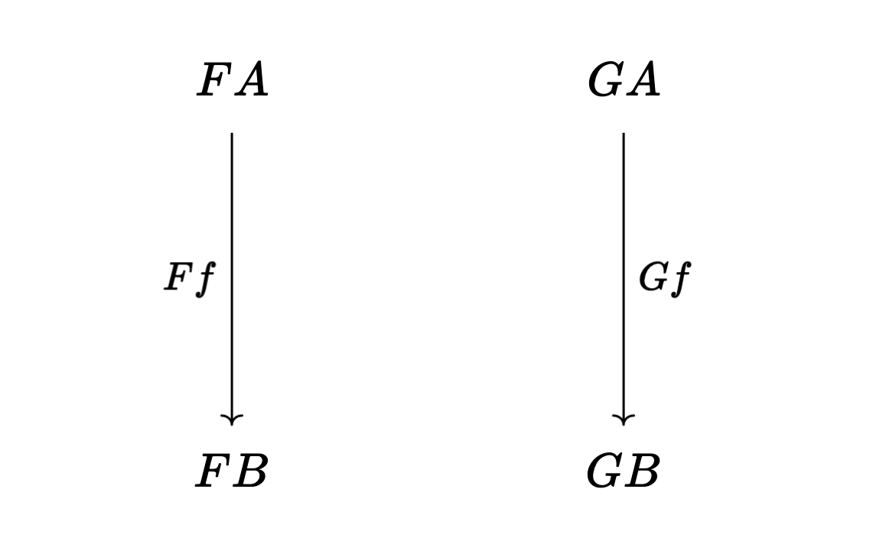
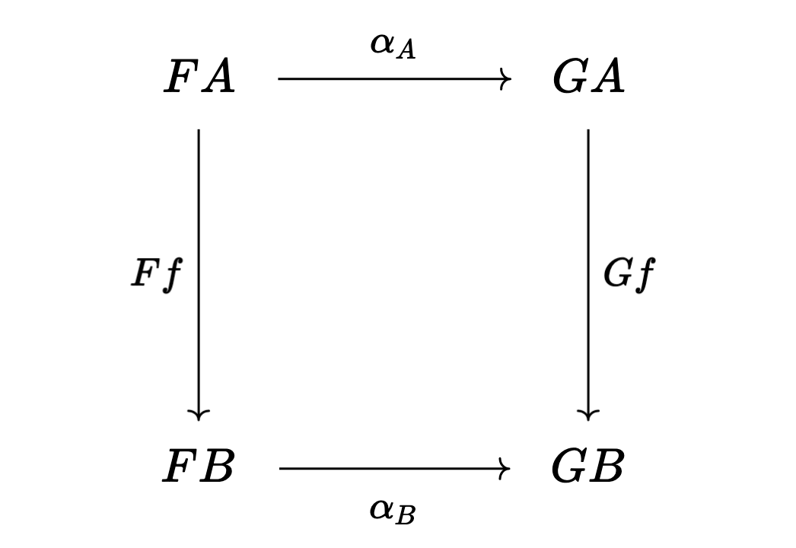
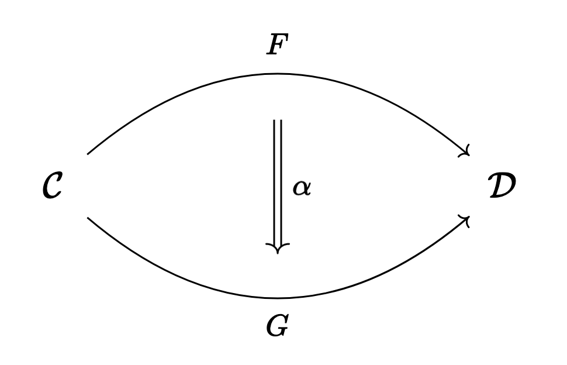
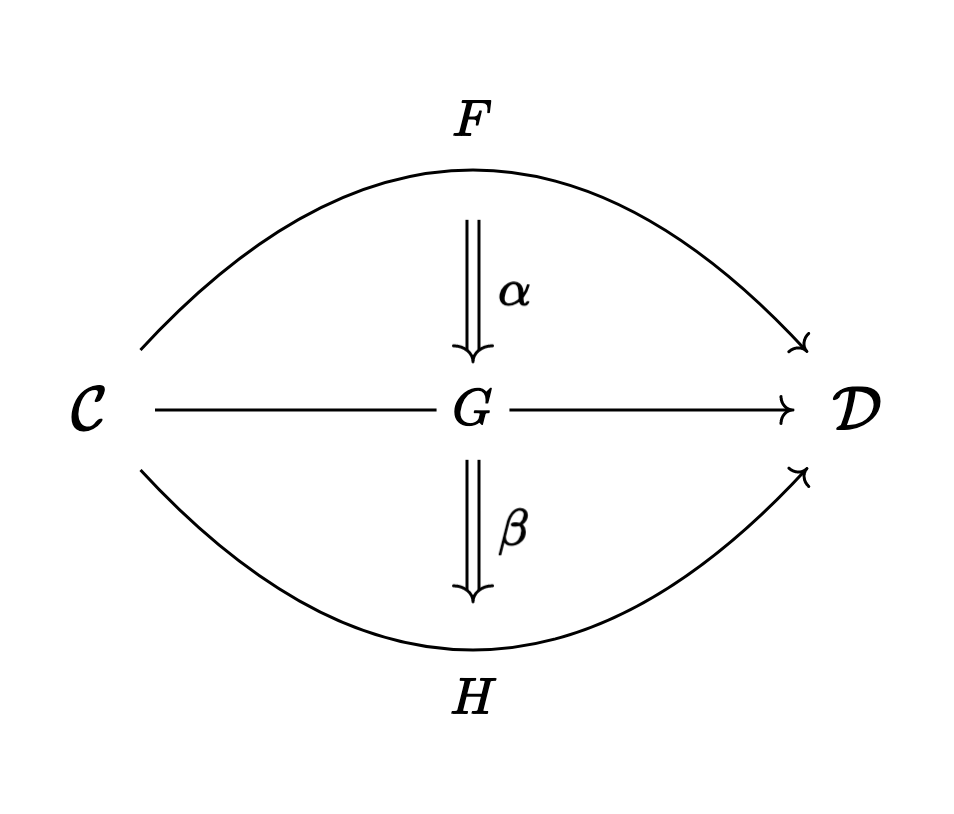
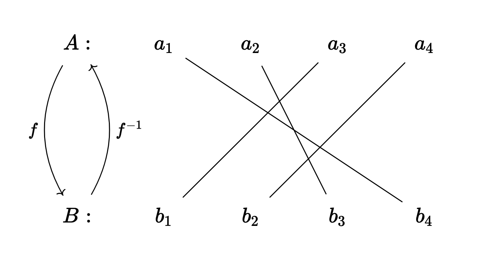
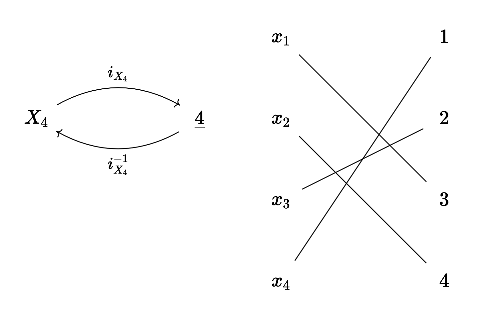
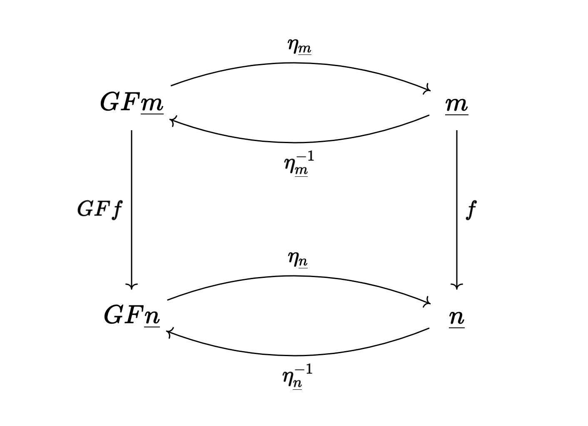
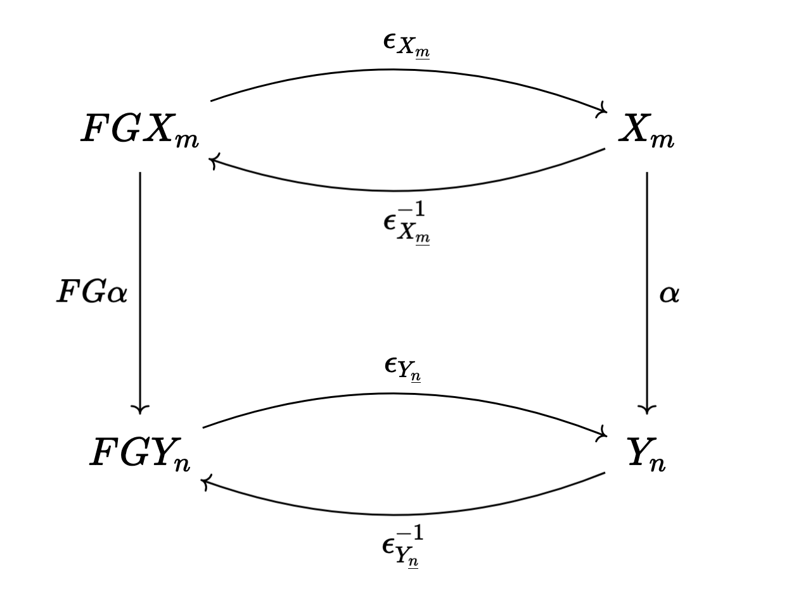

import { Link } from "gatsby"

Today’s post introduces the third fundamental concept of category theory: _natural transformations_.
We’ve already <Link to="/posts/functors">talked</Link> about how a functor $F: \mathcal{C} \to \mathcal{D}$ relates a category $\mathcal{C}$ to another category
$\mathcal{D}$; going one step further, if we have another functor $G: \mathcal{C} \to \mathcal{D}$, can we relate the functor $F$ to
the functor $G$?

A functor $F$ maps an object $A$ of $\mathcal{C}$ to an object $FA$[^1] in $\mathcal{D}$ and maps a morphism $f: A \to B$
in $\mathcal{C}$ to a morphism $Ff: FA \to FB$ in $\mathcal{D}$, and similarly with $G$. Here’s a picture[^2] to start:



If we want to relate functor $F$ to functor $G$, we need to first relate $FA$ to $GA$ and $FB$ to $GB$.
The only things we have to relate objects are morphisms, so for each pair of objects $FA$ and $GA$ we choose a
morphism $\alpha_A: FA \to GA$[^3], which is a morphism in $\mathcal{D}$. So our picture becomes a square:



What about the morphisms $Ff$ and $Gf$? We don’t have morphisms between morphisms like we do for objects. Instead, we want the transformation
from $F$ to $G$ to respect the structure of the category, and that means we need to respect the composition of morphisms.

Looking at the diagram above, we see that we can compose $Gf \circ \alpha_A$ and $\alpha_B \circ Ff$. Respecting composition
means we want these to be equal to each other:

$$
  Gf \circ \alpha_A = \alpha_B \circ Ff.
$$

We say that the diagram _commutes_. A [commuting diagram][commuting diagram] is a diagram in which all morphisms that have the same sources and the same targets
are equal (we call them _parallel_ morphisms); these of course include morphisms that are the composition of other morphisms, as is the case here.
Commuting diagrams are used extensively in category theory, as we’ll see later in the big example.

We can think of this as saying we can either map $FA$ to $GA$ first with $\alpha_A$ and then map to $GB$ with $Gf$, or we can
map $FA$ to $FB$ with $Ff$ first and then translate to $GB$ with $\alpha_B$, and we get the same result either way. It’s a consistency
condition, and I’ll refer to it as the “naturality condition.”

The important point is that the _same_ $\alpha_A$ and $\alpha_B$ have to work for _any_ $f: A \to B$. This is the “natural” part
of “natural transformation.” John D. Cook [writes][john cook]

> Natural transformations are meant to capture the idea that a transformation is “natural” in the sense of not
> depending on any arbitrary choices.
> If a transformation does depend on arbitrary choices, the arrows $\alpha_A$ and $\alpha_B$ would not be reusable
> but would have to change when $f$ changes.



Putting it all together, a natural transformation $\alpha: F \Rightarrow G$ is a collection of morphisms $\alpha_A: FA \to GA$ in
$\mathcal{D}$, one for each object $A$ of $\mathcal{C}$, such that $Gf \circ \alpha_A = \alpha_B \circ Ff$ for all morphisms
$f: A \to B$ in $\mathcal{C}$. The morphism $\alpha_A$ is called the _$A$&#8209;component_ of $\alpha$.

## Example: categories in programming

In programming, particularly in functional programming, the model is that the types of a programming language are the objects
of a category and functions are the morphisms between them.[^4]

For example, we might have a `string` and `int` type, and a function $f:$ `string` $\to$ `int` that given a string
returns the length of a string.

We can also talk about functors, and since we only have one category $\mathcal{C}$ to talk about (for a given programming language),
our functors map from $\mathcal{C}$ to itself (such a functor is known as an _endofunctor_).

Since types are the objects in our category
our functors map types to types. These correspond to type constructors, which we can think of a type that is parameterized by
another type, like [generic types][ts generics] in Typescript.

As a simple example, we can think of a generic list as a functor. So for example, `string` is mapped to `string[]`, which is just a
list of strings.

But functors also map morphisms to morphisms, so we also need to map functions to functions. There needs to be a higher-order function
`fmap` that maps `f: A => B` to `fmap(f): A[] => B[]`, for any function `f` that takes an argument of type `A`and returns something of type`B`.

Of course, `fmap` needs to obey the properties that define a functor, namely that identity functions are mapped to identity functions
and that composition of functions is preserved.

For our list functor, `fmap(f)` simply takes each item in the list of `A`’s and applies `f` to it, giving us a list of `B`’s. You
should check that identities and function composition is preserved. In Typescript we could write

```typescript
function fmap<A, B>(f: (a: A) => B) {
  return (aArr: A[]) => aArr.map(f)
}
```

In fact, this is a bit unnecessary, since we can directly use the map method on any particular instance `aArr` instead of calling
`fmap(f)(aArr)`. The point is that for each function between types `A` and `B` there is a corresponding function between `A[]` and `B[]`.

Another example of a functor in Typescript is the `Maybe` type[^5]:

```typescript
const Nothing = Symbol("nothing")
type Nothing = typeof Nothing
type Maybe<T> = T | Nothing
```

Try implementing the corresponding `fmap`. It should map `f:A => B` to `fmap(f): Maybe<A> => Maybe<B>` while making sure
identity functions and composition are respected.

Now that we’ve talked about functors, we can talk about natural transformations between them. To be concrete,
let’s talk about a natural transformation from `[]` to `Maybe`. A natural transformation in this context
means for each type `A` we need to choose a function `alpha<A>: (aArr: A[]) => Maybe<A>` such that the naturality condition holds.

The naturality condition says that for any functions `f: (aArr: A[]) => B[]` and `g: (mA: Maybe<A>) => Maybe<B>`,
`fmap(g)(alpha<A>(aArr))` equals `alpha<B>(fmap(f)(aArr))`.

You can check that the following works for the `alpha<A>`’s:

```typescript
function alpha<A>(aArr: A[]) {
  return aArr.length === 0 ? Nothing : aArr[0]
}
```

`alpha` returns `Nothing` if `aArr` is empty, otherwise it returns the first element of `aArr`. It’s a
[_parametrically polymorphic_][parametric polymorphism], or _generic_, function. In fact, any generic function `f<A>` between `A[]` and `Maybe<A>` is a natural transformation
between `[]` and `Maybe`.

Some people, like Bartosz Milewski, like to think of functors (in the programming context) as containers, like the list functor we
looked at. Natural transformations don’t modify the contents of their arguments, but simply repackage them, like `alpha` above.
The idea is that it doesn’t matter whether you repackage first and then apply your function, or apply your function first and then repackage, which
is exactly the naturality condition.

If you want to read more about category theory in programming, I highly suggest checking out:

- [Category Theory for Programmers][ctfp]
- [Programming with Categories][pwc] (which is still in draft form, and there is also a whole series of lectures on Youtube)

## Composing natural transformations and functor categories

At the end of my earlier <Link to="/posts/functors">post</Link> on functors, I mentioned that functors from a category $\mathcal{C}$ to a category $\mathcal{D}$
form a category with the functors themselves comprising the objects. This functor category is often denoted by $\mathcal{D}^{\mathcal{C}}$.
By now you probably see that natural transformations should be the morphisms between functors.

Recalling the <Link to="/posts/what-even-is-a-category">definition</Link> of a category, we need to identify identity morphisms
and define composition of morphisms.

Suppose we have two natural transformations $\alpha: F \Rightarrow G$ and $\beta: G \Rightarrow H$. We can define the composition
$\beta \circ \alpha$ by composing the components of $\alpha$ and $\beta$:

$$
(\beta \circ \alpha)_A = \beta_A \circ \alpha_A
$$



I leave it to you to check that $\beta \circ \alpha$ is indeed a natural transformation from $F$ to $H$ (hint: try drawing a diagram
that combines the naturality diagram “squares” for $\alpha$ and $\beta$ that we saw earlier when talking about the
definition of a natural transformation).

As for identity natural transformations, the components of $id_F: F \Rightarrow F$ are simply the identity morphisms $(id_F)_A = id_{FA}$,
as you probably guessed.

## Natural isomorphisms and equivalence of categories

If all the components of a natural tranformation $\alpha: F \Rightarrow G$ are isomorphisms, then we say that $\alpha$ is a
_natural isomorphism_.

Remember that an isomorphism is just a morphism $f: X \to Y$ that can be “undone” in the sense that there is
another morphism $f^{-1}: Y \to X$ such that $f^{-1} \circ f = id_X$ and $f \circ f^{-1} = id_Y$. $f^{-1}$ is called the _inverse_
of $f$.

The notion of isomorphism is category theory’s preferred notion of sameness (as opposed to strict equality). See the section on
isomorphisms <Link to="/posts/more-on-categories">here</Link> for more on this point.



A natural isomorphism, then, is a natural transformation that can be reversed (try proving that the inverses $\alpha_A^{-1}: GA \to FA$
form a natural transformation $\alpha^{-1}: G \Rightarrow F$).

Natural isomorphisms allow us to talk about _equivalent categories_. Suppose we have two different categories $\mathcal{C}$ and
$\mathcal{D}$ that we want to say are the same without actually being the same category. One possibility is to say that $\mathcal{C}$
and $\mathcal{D}$ are isomorphic, meaning that there exist inverse functors $F: \mathcal{C} \to \mathcal{D}$ and
$G: \mathcal{D} \to \mathcal{C}$ (that is, $G = F^{-1}$).

But this is often too restrictive of a statement for categories. $\mathcal{C}$ and $\mathcal{D}$ might be the same for all practical purposes,
but aren’t isomorphic. Instead, we consider a more general notion of isomorphism (for categories) called _equivalence_.

Another way to think about this is that with objects in a general category, we only have morphisms between objects, so the best
we can do is say that two objects are isomorphic for our notion of sameness.

But in the case where our objects are categories, our morphisms
are functors, and functors between two categories form a category, so we have morphisms between functors: natural transformations.

In other words, there is more structure in the category of categories than in a general category (there are morphisms of morphisms),
and we can use this extra structure to refine our notion of sameness for categories.

The idea is that instead of requiring the existence of inverse functors $F$ and $G$ such that the composition $GF = id_\mathcal{C}$
and $FG = id_\mathcal{D}$ (note strict equality), we just require that there are _natural isomorphisms_ between $GF$ and $id_\mathcal{C}$
and between $FG$ and $id_\mathcal{D}$.

This is a more general notion of sameness for categories than isomorphism, because isomorphic categories are also equivalent categories,
but equivalent categories don’t need to be isomorphic, as we’re about to see.

When I first came across this idea of equivalence, I didn’t quite understand the significance. I didn’t see how one category could be
“the same” as another but not actually be isomorphic. I finally understood it once I worked through the following example.

## Big example

This example also allows us to review the concepts we’ve discussed: categories, functors, isomorphisms, and natural transformations.
This example is a bit of a challenge, but if you get confused, take another look at the relevant definitions. I highly suggest following along
by writing everything out on paper.

We’re gonna show that the categories $\mathcal{C}$ and $\mathcal{D}$ are equivalent. $\mathcal{C}$ is the category of finite[^6]
sets $\underline{n}$ of the form $\{1, 2, 3, \ldots, n \}$ for all positive integers $n$. The morphisms of $\mathcal{C}$ are just the
functions between $\underline{n}$ and $\underline{m}$ for all $n$ and $m$.

The category $\mathcal{D}$ is the category **FinSet** of _all_ finite sets and functions between them. For example,
$A = \{$'apple', 'tomato', 'red'$\}$ and $B = \{3, 2, \pi\}$ are finite sets and $f: A \to B$ defined by $f($'apple'$) = 3$,
$f($'tomato'$) = 2$, and $f($'red'$) = \pi$ is a function from $A$ to $B$ (in fact $f$ is an isomorphism).

For each $n$, **FinSet** has an infinite number of sets of size $n$, whereas $\mathcal{C}$ has just one:
$\underline{n} = \{1, 2, 3, \ldots, n \}$.

Sets of the same size are isomorphic, meaning each element of one set can be mapped uniquely to an element of the other set, and no elements
in either set are missed, as with $f$ in the example above between $A$ and $B$.
Isomorphic sets are essentially the same in the sense that they are interchangeable.

The intuition behind the equivalence between $\mathcal{C}$ and **FinSet** is that if we group all sets of the same size
in **FinSet**, we get $\mathcal{C}$. Let’s prove this.

What we need to show is that there are functors $F: \mathcal{C} \to$ **FinSet** and $G:$ **FinSet**$\to \mathcal{C}$ such that
there is a natural isomorphism $\eta$[^7] between $GF$ and the identity functor $id_\mathcal{C}$, and a natural isomorphism $\epsilon$[^8]
between $FG$ and $id_{\text{FinSet}}.$

### Defining functors F and G

Our first step is to define the functor $F: \mathcal{C} \to$ **FinSet**. We have to decide where to map each $\underline{n}$
to in **FinSet**. You could choose your favorite set of size $n$, but since $\underline{n}$ is also a set in **FinSet**, let’s just
map it to itself:

$$
F\underline{n} = \underline{n}.
$$

As for the morphisms of $\mathcal{C}$, which are functions $f: \underline{n} \to \underline{m}$, $F$ just maps $f$ to itself:

$$
Ff = f.
$$

Identity functions are obviously preserved, as is composition: $Fg \circ Ff = gf = F (gf)$.

That’s all we need to define $F$. $F$ just recognizes the fact that $\mathcal{C}$ is a subcategory of **FinSet**[^9].
Now let’s define $G:$ **FinSet**$\to \mathcal{C}$.

For each set $X_m$ of size $m$ of **FinSet**, we simply map it to $\underline{m} = \{ 1,2,3, \ldots, m\}$:

$$
G X_m = \underline{m}.
$$

The functions are a bit trickier.
For each function $f: X_m \to Y_n$, we need to map it to a function $Gf: \underline{n} \to \underline{m}$, while ensuring that
identities are mapped to identities, and composition is preserved.

Since each $X_m$ is a finite set, we can list (which is the same as ordering) all its elements. If you think about it, this is the same as defining a function
$i_{X_m}: X_m \to \underline{m}$. Moreover, $i_{X_m}$ is an isomorphism, so there exists $i_{X_m}^{-1}: \underline{m} \to X_m$ such that
$i_{X_m}^{-1} \circ i_{X_m} = id_{X_m}$ and $i_{X_m} \circ i_{X_m}^{-1} = id_{\underline{m}}$.
Note that there are usually many different ways to list the elements of a given $X_m$, so there are many such $i_{X_m}$.
We just need to choose one for each $X_m$.



Then, $G$ maps each $\alpha: X_m \to Y_n$ to

$$
G\alpha = i_{Y_n} \circ \alpha \circ i_{X_m}^{-1}
$$

which is a function from $\underline{m}$ to $\underline{n}$.
Here’s how we can interpret this: first map $\underline{m}$ to $X_m$ using our ordering function $i_{X_m}^{-1}$, then map $X_m$ to $Y_n$
with $\alpha$, then finally map $Y_n$ to $\underline{n}$ with $i_{Y_n}$.

We need to check that identities are preserved:

$$
G id_{X_m} = i_{X_m} \circ id_{X_m} \circ i_{X_m}^{-1} \\[5pt]
    = (i_{X_m} \circ id_{X_m}) \circ i_{X_m}^{-1} \\[5pt]
    = i_{X_m} \circ i_{X_m}^{-1} \\[5pt]
    = id_{\underline{m}}
$$

The third equality above follows from the fact that identities act like the number 1 with multiplication: it doesn’t change anything.
The last equality follows from the fact that $i_{X_m}$ is an isomorphism.

We also need to check that composition of functions is preserved. Let $\alpha: X_m \to Y_n$ and $\beta: Y_n \to Z_p$ be functions.
Then $G$ maps the composition $\beta \alpha$ to

$$
G(\beta \alpha) = i_{Z_p} \circ (\beta \alpha) \circ i_{X_m}^{-1} \\[5pt]
    = i_{Z_p} \circ (\beta \circ id_{Y_n} \circ \alpha) \circ i_{X_m}^{-1} \\[5pt]
    = i_{Z_p} \circ \beta \circ (i_{Y_n}^{-1} \circ i_{Y_n}) \circ \alpha \circ i_{X_m}^{-1} \\[5pt]
    = (i_{Z_p} \circ \beta \circ i_{Y_n}^{-1}) \circ (i_{Y_n} \circ \alpha \circ i_{X_m}^{-1}) \\[5pt]
    = G\beta \circ G\alpha
$$

The second equality follows from the fact that I can insert an identity function anywhere since it doesn’t change anything.
The third equality follows from rewriting $id_{Y_n}$ in terms of $i_{Y_n}$ and its inverse $i_{Y_n}^{-1}$.

Whew. We’re halfway done. Now we need to prove that there are natural isomorphisms between $GF$ and $id_{\mathcal{C}}$ and between
$FG$ and $id_{\text{FinSet}}$.

### The natural isomorphisms $\eta$ and $\epsilon$

Here’s the picture to have in mind (remember that $id_\mathcal{C} \underline{m} = \underline{m}$ and $id_\mathcal{C} f = f$):



We need to show the existence of an isomorphism $\eta_m: GF \underline{m} \to \underline{m}$ for every $\underline{m}$
such that the above diagram commutes. In particular, this means that

$$
f \circ \eta_{\underline{m}} = \eta_{\underline{n}} \circ GF f
$$

and also

$$
 GFf \circ \eta_{\underline{m}}^{-1} = \eta_{\underline{n}}^{-1} \circ f.:
$$

The idea of the natural isomorphism between $GF$ and $id_\mathcal{C}$ is that the objects $GF\underline{m}$ and $\underline{m}$ are
isomorphic, and those isomorphisms allow us to express every $f$ and $GFf$ in terms of each other:

$$
GFf = \eta_{\underline{n}}^{-1} \circ f \circ \eta_{\underline{m}} \\[5pt]
f = \eta_{\underline{n}} \circ GFf \circ \eta_{\underline{m}}^{-1:}
$$

Looking at the diagram above, this just says that, for example, I can go from $GF\underline{m}$ to $GF\underline{n}$ directly with
$GFf$, or I can first map to $\underline{m}$ with $\eta_{\underline{m}}$, then map to $\underline{n}$ with $f$,
then map to $GF\underline{n}$ with $\eta_{\underline{n}}^{-1}$, and the result is the same either way.

Let’s think a little more about the functor $GF: \mathcal{C} \to \mathcal{C}$. It sends each $\underline{n}$ to

$$
GF \underline{n} = G(F\underline{n}) = G\underline{n} = \underline{n}.
$$

For each $f: \underline{m} \to \underline{n}$, $GF$ sends it to

$$
GFf = G (Ff) = Gf = i_{\underline{n}} \circ f \circ i_{\underline{m}}^{-1}
$$

Remember that $i_{\underline{m}}: \underline{m} \to \underline{m}$ is just an ordering of the elements of $\underline{m} =\{1,2,\ldots,m\}$,
and we can just choose to order them in the obvious way, which is the same as saying $i_{\underline{m}}$ is the
identity function $id_{\underline{m}}$.

Then

$$
GFf = id_{\underline{n}} \circ f \circ id_{\underline{m}}^{-1} = f
$$

(remember that an identity morphism is its own inverse).
So in fact (with these choices for $i_{\underline{n}}$), $GF$ is the identity functor $id_\mathcal{C}$. Our naturality square
above collapses into just a vertical line.

The natural isomorphism $\eta$ is then really simple: just choose
$\eta_{\underline{m}} = \eta_{\underline{m}}^{-1} = id_{\underline{m}}$ to be the components of $\eta$ for all $\underline{m}$.

The natural isomorphism between $FG$ and $id_{\text{FinSet}}$ is less trivial. Here’s the diagram that we need to commute:



Let’s think about what $FG$ does. It maps any set $X_m$ with $m$ elements to

$$
FGX_m = F(\underline{n}) = \underline{n}.
$$

It sends a function
$\alpha: X_m \to Y_n$ to

$$
FG\alpha = F(i_{Y_n} \circ \alpha \circ i_{X_m}^{-1}) = i_{Y_n} \circ \alpha \circ i_{X_m}^{-1}
$$

since $F$ just maps each morphism in $\mathcal{C}$ to itself in **FinSet**.

For the components of our natural isomorphism, we need an isomorphism $\epsilon_{X_m}: FGX_m \to X_m$, which is an isomorphism from
$\underline{m}$ to $X_m$ since $FGX_m = \underline{m}$. In fact we’ve already been using an isomorphism between $X_m$ and $\underline{m}$:
the function $i_{X_m}: X_m \to \underline{m}$ (remember this is our ordering of the elements of $X_m$).
It seems we should choose $\epsilon_{X_m}$ to be

$$
  \epsilon_{X_m} = i_{X_m}^{-1}.
$$

We just have to check that the naturality conditions hold, which requires $\alpha \circ \epsilon_{X_m} = \epsilon_{Y_n} \circ FG\alpha$
and $FG\alpha \circ \epsilon_{X_m}^{-1} = \epsilon_{Y_n}^{-1} \circ \alpha$ for every $\alpha: X_m \to Y_n.$

Let’s check the first condition:

$$
\epsilon_{Y_n} \circ FG\alpha = \epsilon_{Y_n} \circ i_{Y_n} \circ \alpha \circ i_{X_m}^{-1} \\[5pt]
    = i_{Y_n}^{-1} \circ i_{Y_n} \circ \alpha \circ i_{X_m}^{-1} \\[5pt]
    = id_{Y_n} \circ \alpha \circ i_{X_m}^{-1} \\[5pt]
    = \alpha \circ i_{X_m}^{-1} \\[5pt]
    = \alpha \circ \epsilon_{X_m}.
$$

Finally,

$$
FG\alpha \circ \epsilon_{X_m}^{-1} = i_{Y_n} \circ \alpha \circ i_{X_m}^{-1} \circ \epsilon_{X_m}^{-1}\\[5pt]
    = i_{Y_n} \circ \alpha \circ i_{X_m}^{-1} \circ i_{X_m} \\[5pt]
    = i_{Y_n} \circ \alpha \circ id_{X_m} \\[5pt]
    = i_{Y_n} \circ \alpha \\[5pt]
    = \epsilon_{Y_n}^{-1} \circ \alpha.
$$

That completes the proof that $\mathcal{C}$ and **FinSet** are equivalent categories. But they are not isomorphic, intuitively because
**FinSet** has a _lot_ more objects than $\mathcal{C}$ does[^10].

If you’re able to follow this whole proof, then I’d say you have a pretty good grasp of the basic concepts of category theory!

## Final notes

With this post we complete our crash course on the basics of category theory (categories, functors, and natural transformations).
There is a lot more to category theory; there are some very important concepts we haven’t even mentioned, like limits, colimits,
and adjunctions. We could also talk about special types of categories, like _monoidal_ and _compact closed_ categories,
or we could generalize the notion of categories to _enriched_ categories, for example.

Some of the resources I have been using to learn category theory that you might want to check out include:

- [Seven Sketches in Compositionality: An Invitation to Applied Category Theory][seven sketches]
- [Category Theory for Programmers][ctfp]
- [Programming with Categories][pwc]
- [Category Theory in Context][ctic]
- Tai-Danae Bradley’s blog [Math3ma][math3ma]

The last two resources are great, but they do assume a higher level of mathematical knowledge than the first three.

[john cook]: https://www.johndcook.com/blog/2017/03/16/natural-transformations/
[hask]: http://math.andrej.com/2016/08/06/hask-is-not-a-category/
[ts generics]: https://www.typescriptlang.org/docs/handbook/2/generics.html#generic-types
[maybe]: https://stackoverflow.com/questions/50573891/maybe-a-type-in-typescript
[parametric polymorphism]: https://en.wikipedia.org/wiki/Parametric_polymorphism
[quiver]: https://github.com/varkor/quiver
[ctfp]: https://bartoszmilewski.com/2014/10/28/category-theory-for-programmers-the-preface/
[pwc]: http://brendanfong.com/programmingcats.html
[ctic]: https://math.jhu.edu/~eriehl/context/
[math3ma]: https://www.math3ma.com/categories/category-theory
[seven sketches]: https://arxiv.org/abs/1803.05316
[commuting diagram]: https://www.math3ma.com/blog/commutative-diagrams-explained

[^1]:
    From now on I will generally drop parentheses to save space and clutter unless it’s unclear without them,
    so in this case $FA$ is the same as $F(A)$. I will also sometimes drop the composition symbol $\circ$ for the same reasons,
    so for example $gf$ is the same as $g \circ f$.

[^2]: The diagrams in today’s post were made with [quiver][quiver].
[^3]: $\alpha$ is the greek letter “alpha.”
[^4]:
    Probably the most well-known programming language that explicitly incorporates these ideas is Haskell. But there is [debate][hask]
    on whether Haskell’s types and functions form a true category.

[^5]: I saw this particular implementation first by Estus Flask [here][maybe].
[^6]: By finite we mean that each set only has a finite number of elements.
[^7]: $\eta$ is the Greek letter “eta”.
[^8]: $\epsilon$ is the Greek letter “epsilon”.
[^9]: Mathematicians say $F$ is an _inclusion_ of $\mathcal{C}$ in **FinSet**.
[^10]:
    A more technical statement would be that $\mathcal{C}$ has a countable set of objects,
    while **FinSet** has an uncountable collection of objects.
