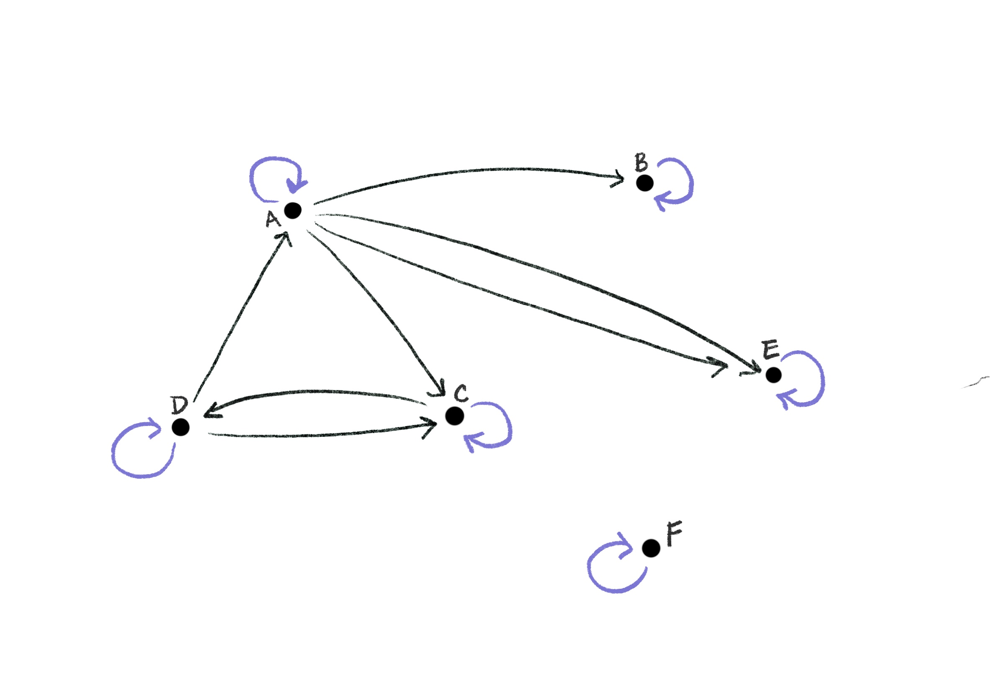
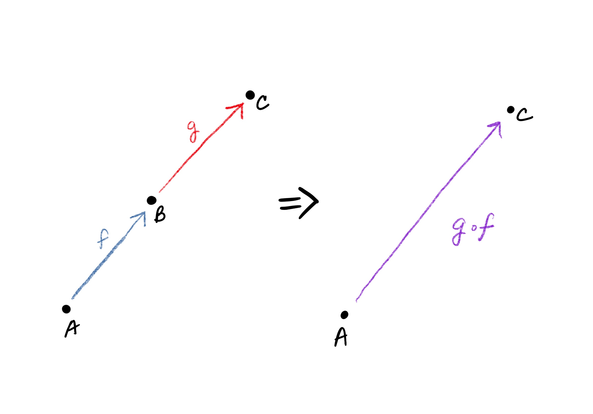
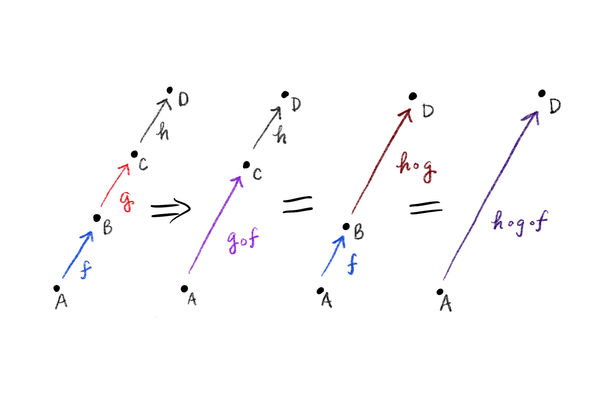
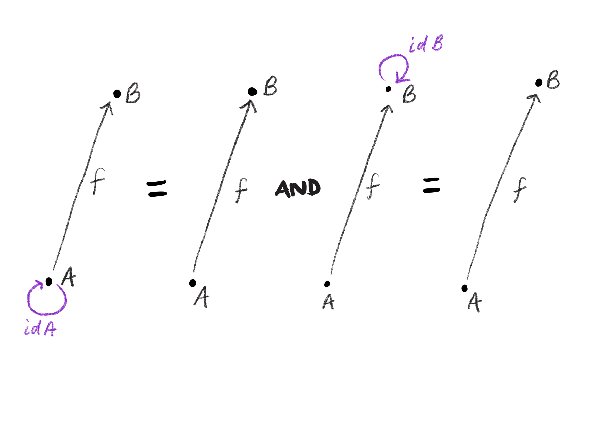
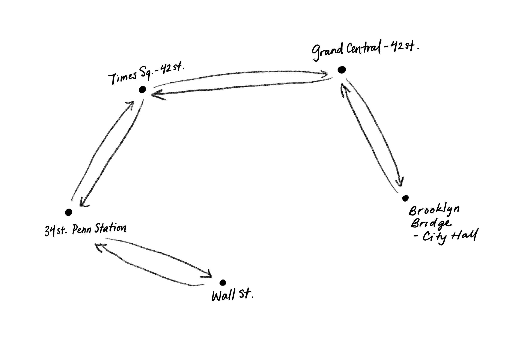
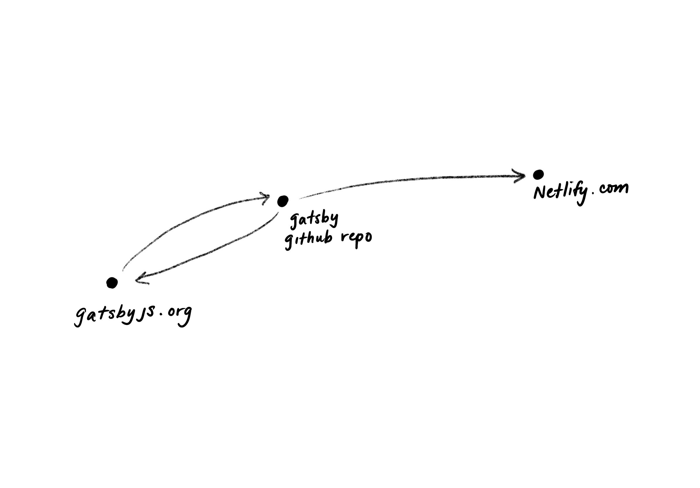

> _A category is an organized network of relationships_

as described by Fong, Spivak, Milewski. We can intuitively picture a category as a collection of dots with arrows going between them:

These dots are called _objects_, and the arrows between them are called _morphisms_. If $A$ and $B$ are any two objects, a morphism from $A$ to $B$ is written as $f: A \to B$ (and pronounced “f from A to B”), for example.

From the picture above, hopefully it’s clear what we mean by a network of relationships, but why is it organized? Because the objects and relationships must satisfy two properties:

1. Morphisms can be combined, or _composed_, in a particular way to form new morphisms. In our picture of a category, arrows can be joined up “tip to tail” to form a new arrow. More formally, if we have morphisms $f: A \to B$ and $g: B \to C$, then we get a new morphism $h: A \to C$. We denote that $h$ is formed by composing $f$ and $g$ by writing $h$ as $g \circ f$ (pronounced “g composed with f” and note that the order does matter).
    

   

   When composing several morphisms together, the order in which you compose
   them doesn’t matter (as long as the overall sequence stays the same). For
   example, if you have $f:A \to B$, $g: B \to C$, and $h: C \to D$, then

   $$
     h \circ g \circ f = (h \circ g) \circ f = h \circ (g \circ f)
   $$

   

2. In addition, for each object $A$ there must be a special morphism from $A$ to $A$, called the _identity_ morphism, which we’ll write as $id_A$. What’s special about it is that for any $f: A \to B$, the following two equations are true:

   $$
   f \circ id_A = f \\
   id_B \circ f = f
   $$

   

We can think of the identity morphism as acting like zero does when adding numbers &mdash; it doesn’t change anything.

A quick note about pictures of categories &mdash; since we know that all
objects _must_ have an identity morphism, we usually don’t bother to
draw them.

The discussion so far has been rather abstract, so let’s take a look at some
concrete examples.

## Examples of categories

### The New York City Subway system

Our first example is the New York City Subway system. To see that this forms a category, we have to specify what the objects and morphisms are.

The objects are simply all the stations (472 of them according to [Wikipedia][mta wiki]).

The morphisms are less tangible, but we say there is a morphism between two stations if you can get from one to the other without having to leave the subway system. For example, there’s a morphism, two in fact, between the Times Sq&ndash;42 St station and the Wall Street Station (take the 3 train).

We also have to check for identity morphisms and compositionality. Clearly each station has an identity morphism: if you’re at 34th Street-Penn Station, then you can reach 34th Street-Penn Station by simply doing nothing at all! And clearly morphisms compose: if you can get from station A to station B, and from station B to station C, then you can get from station A to station C.

### The internet

We get a category if we take websites to be the objects and connectivity between sites to be the morphisms. By connectivity, I mean that you can reach one website from another, by clicking a link for example.

### Module dependencies

We take the objects to be the modules, and the morphisms are the dependencies: there is a morphism from module A to module B if A depends on B.

Each module has an identity morphism, since we can say that a module depends on itself, although we do not explictly express this in code.

Composition arises from indirect dependencies: if A depends on B which in turn depends on C, then A also depends on C.

All these examples seem to be unrelated to each other on the surface, but we see that in fact they are all organized networks of relationships.

## A non&ndash;example

What if we consider a social network, like Facebook? We might say the objects are people, and the morphisms are friendships. Social networks do form [graphs][graph], which are a type of structure as illustrated below, but they do not form a _composable_ structure.

 friends with Eve.")

What goes wrong? We have to check the two requirements of a category: identities and composition.

Each person has a potential identity morphism, since we can say that everyone is friends with themselves (I hope!).

What about composition of friendships? This would be equivalent to saying that a friend of your friend is also your friend, which is _not_ necessarily true, so composition fails, and thus a social network does not form a category.

[mta wiki]: https://en.wikipedia.org/wiki/New_York_City_Subway
[graph]: https://en.wikipedia.org/wiki/Graph_(discrete_mathematics)
