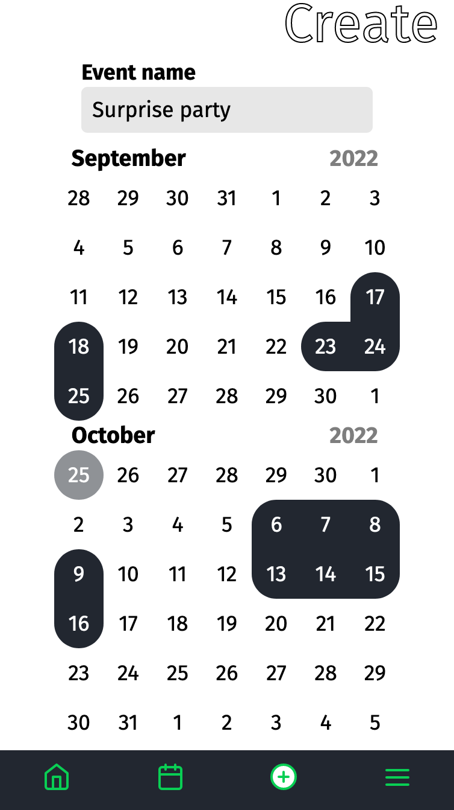
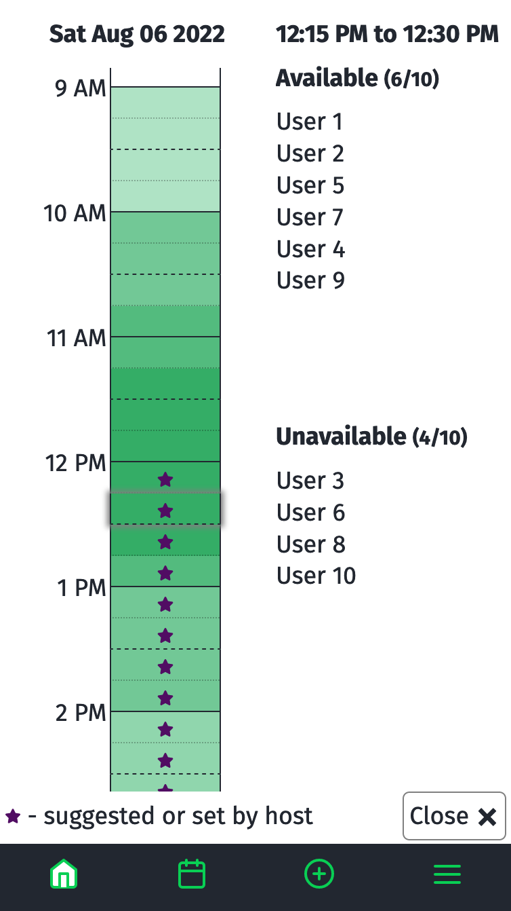

> Tldr: This project was inspired by the site [When2meet][when2meet], which a few of my friends use for scheduling things like practices. 
> My project, _Are You Free Then_, is a full [Ruby on Rails][rails] app with some React added in a few places. It’s still very much a **work in progress**, but you can check it out[^1] [here][are-you-free-then], and use email: guest-user@email.com and password: password to log in without having to create your own account.

The original When2meet (which is still around) helps people figure out the best time for a group of people to meet. 
You select some dates and get a link for the event, and then people can enter the times they have free for that event by going to that link.

The features that my friends like about When2meet are being able to click and drag rectangular selections on the calendar and the ability to visualize what times people have in common.

But there are some things they didn’t like:
1. It’s not designed for mobile at all.
2. They often have to fill out the same times for multiple events, which is annoying.

The site is about a decade old from what I can tell, so I decided to make a more modern version that my friends could use. 

To handle the second point above, users create accounts so that they can enter and save the times they are free. Events pull that information automatically when displaying times. 

There’s still a bunch of work to do, including some better styling, improving accessibility, and handling when event times are decided upon.

Other potential features I’ve thought about include having friend groups and sending event invites in app so that you don’t have to copy and paste event codes.

[are-you-free-then]: https://aqueous-river-04352.herokuapp.com/
[rails]: https://rubyonrails.org/
[when2meet]: https://www.when2meet.com/

[^1]: For some reason, the rectangular selection on the calendar doesn’t seem to be working correctly on mobile Chrome or Safari (the relevant pointer events don’t seem to be firing). It works fine on desktop versions and both mobile and desktop Firefox. You can still tap each individual date though.