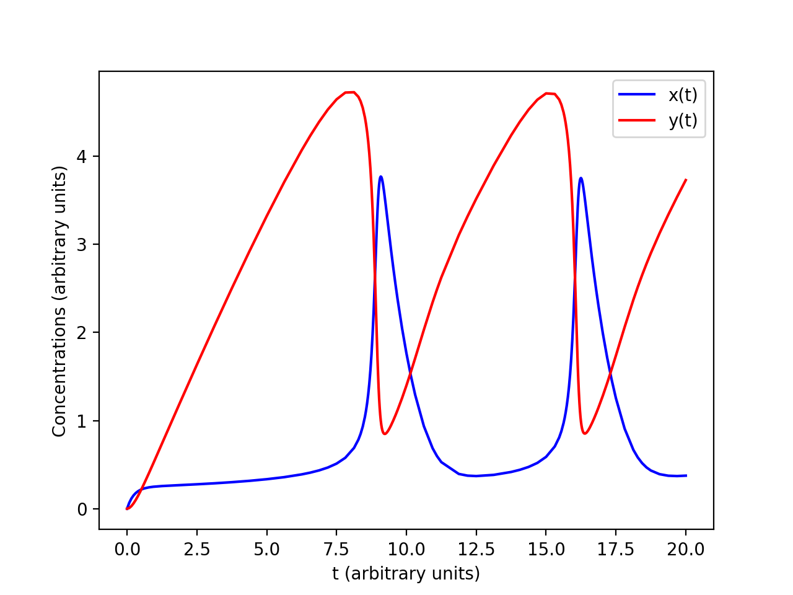
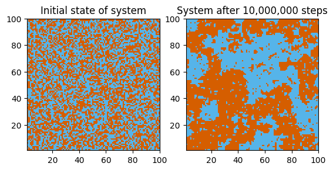
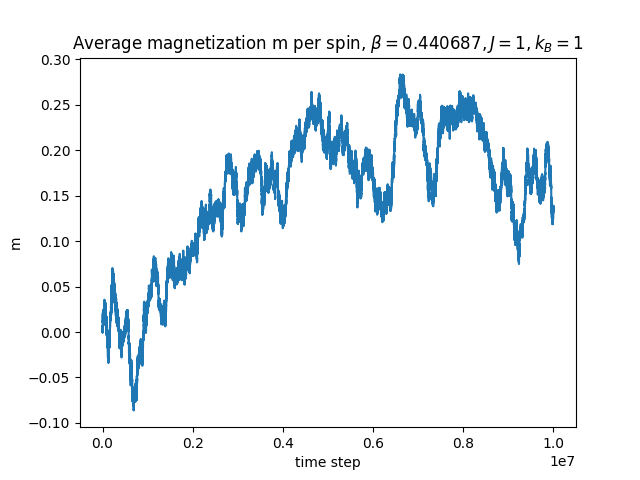

## Motivation

I once took a class on computational physics in grad school, but the class was taught using Fortran 90, which is usually used for intense numerical applications in academia and maybe industry, but not much else. I wanted to learn some Python and also review and learn more about computational techniques, so I decided to work my way through Mark Newman’s _Computational Physics_. My solutions to the exercises can be found [here][github repo].

## Thoughts

The most interesting thing I learned was the idea of [Richardson extrapolation][richardson extrapolation]. The book introduces this through [Romberg integration][romberg] and the [Bulirsch-Stoer][bulirsch-stoer] method of solving ordinary differential equations.

Here’s the basic idea. Suppose you have a method to approximate some quantity $A$, and that this method depends on a small parameter $h$ in such a way that the approximations get better and better the smaller $h$ is. As a concrete example, think of computing a definite integral and $h$ as the step size in a numerical integration method such as the [trapezoidal rule][trap rule].

The idea of Richardson extrapolation is that by approximating $A$ with two different (appropriately related) values of $h$, you can combine them to get a new estimate with a much smaller error estimate. How those values of $h$ should be related and how you combine them depend on the specifics of what you’re computing.

For example, in Romberg integration you compute an estimate $I_1$ with step size $h$, then compute a second estimate $I_2$ with a step size $h/2$. You get a new, better estimate by adding to $I_2$ a term proportional to $I_2 - I_1$.

### Examples

#### Adaptive Bulirsch-Stoer

In the example above, we solve the coupled, nonlinear ordinary differential equations

$$
    \frac{dx}{dt} = 1 - (b + 1) x + a x^2 y, \quad
    \frac{dy}{dt} = bx - a x^2 y
$$

with $a=1, b=3$ with initial conditions $x(0) = y(0) = 0$ and accuracy of $10^{-10}$ per unit time. We solved this system using an adaptive Bulirsch-Stoer method. See my solution [here][bulirsch-stoer solution].

#### Adaptive trapezoidal rule

 changes less rapidly.")

Another example is using an adaptive trapezoidal rule to estimate the value of

$$
\int_0^{10} \left(\frac{\sin x}{x}\right)^2 \ dx
$$

We use the trapezoidal rule to compute the integral, but the step size is automatically adjusted so that the error estimate for each integration slice is no greater than some target value (so that the overall error is bounded). See my solution [here][adap trap solution].

#### 2D Ising model

Of course we also simulate the well-known 2D ferromagnetic [Ising model][ising]. We perform a Markov chain Monte Carlo simulation of the Ising model on a 100 &times; 100 square lattice with zero magnetic field and nearest-neighbor interactions.

[github repo]: https://github.com/BLing88/computational-physics
[richardson extrapolation]: https://en.wikipedia.org/wiki/Richardson_extrapolation
[romberg]: https://en.wikipedia.org/wiki/Romberg%**27s_method**
[bulirsch-stoer]: https://en.wikipedia.org/wiki/Bulirsch%E2%80%93Stoer_algorithm
[trap rule]: https://en.wikipedia.org/wiki/Trapezoidal_rule
[adap trap solution]: https://github.com/BLing88/computational-physics/blob/master/ch_5-integrals-and-derivatives/ch_5-20_advanced-adaptive-trapezoidal-rule.py
[bulirsch-stoer solution]: https://github.com/BLing88/computational-physics/blob/master/ch_8-odes/ch_8-18_Oscillating_chemical_reactions.py
[ising]: https://en.wikipedia.org/wiki/Ising_model
